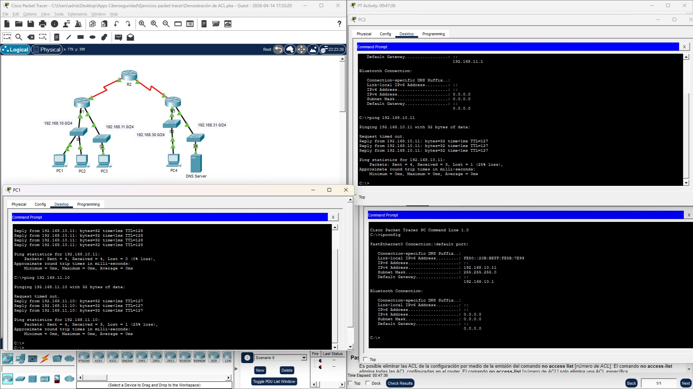
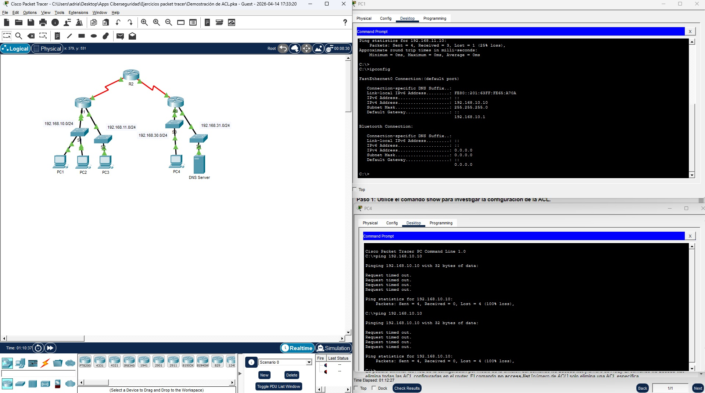
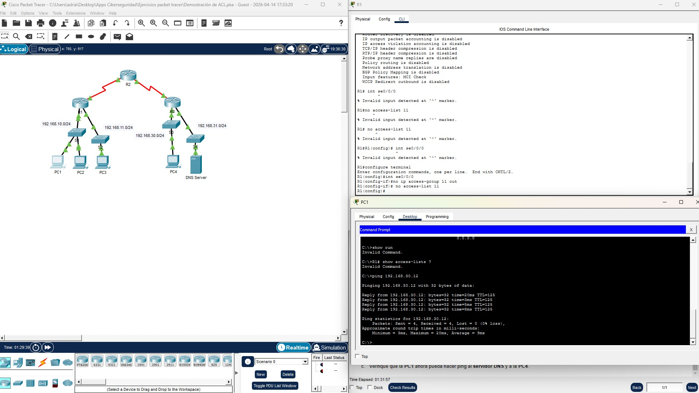

# ACL Demo - Cisco Course

## **Objetivos**

### Parte 1: Verificar la conectividad local y probar la lista de control de acceso
### Haga ping a los dispositivos de la red local para verificar la conectividad

Para ello lo primero que hago es mirar la IP de cada dispositivos con ipconfig para luego hacer ping entre ellos y comprobar 
la conectividad del ACL

### Haga ping a los dispositivos en las redes remotas

Vuelvo a hacer ping, esta vez desde el PC4. La conexión falla. Investigando me doy cuenta que el router R1 está configurado como ACL

### Parte 2: Eliminar la lista de control de acceso y repetir la prueba

Para ello primero entro la modo privilegiado con "enable" y al modo configuracion global con "configuracion terminal"
Despues entro en la intefaz serial 0/0/0 y quito la lista

